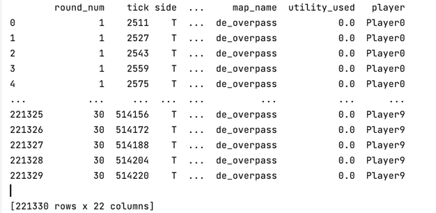
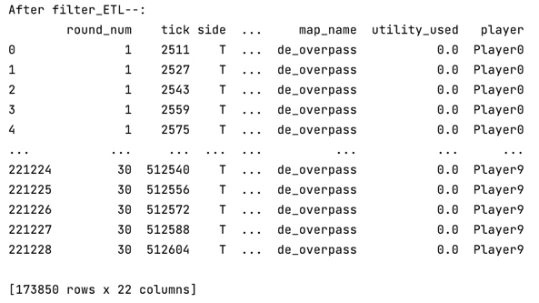

# Steps to run this Python project
git clone git@github.com:luhuanju/PythonEG.git. 

Use IDE open this project and run ProcessGameState file


# Solutions
Procedures

###  Read .pickle file

``` python 
    def load_file(self, file_path):
        split_file_name = os.path.splitext(file_path)
        # get the file extension
        if split_file_name[-1] == '.pickle':
            return pd.read_pickle(file_path)
        elif split_file_name[-1] == '.parquet':
            return pd.read_parquet(file_path)
        else:
            return None
```


###  Handle file ingestion and ETL
This step involves reading the data from the Parquet file and format it into a DataFrame.
When I'm trying to extract weapons from our datasource, I notice that some column 'inventory' might not exist.
So, in this step. I filter some rows that 'inventory' is empty.
``` python
    def filter_ETL(self):
        # filter some rows that does not have the column 'inventory'
        self.game_state_data = self.game_state_data.dropna(subset=['inventory'])
```
##### before filter/ETL

##### after filter/ETL 



#### 1 b : Return whether or not each row falls within a provided boundary
This step involves determining if each row of data falls within a given boundary. Form the img we are given,  This can be done by testing if the x, y, and z coordinates from each row fall within the given bounds. Which is the light blue area.
I defined a helper function using for checking.
``` python
check_boundary_for_eachrow()
``` 
``` python
game.game_state_data['inside_boundary'] = game.game_state_data.apply(game.check_boundary_for_eachrow, axis=1)
``` 
Countering each row that the ['inside_boundary']=True.

#### 1 c : Extract the weapon classes from the inventory json column
###### My intuitive thinking:
This step involves extraction the weapon classes from the inventory json column in the dataset  


``` python
weapons_classes = game.get_weapon_class()
print(weapons_classes)
```
The result：
``` python
{'Rifle', 'Grenade', 'SMG', 'Pistols'}

```

#### 2 a: Is entering via the light blue boundary a common strategy used by Team2 on T (terrorist) side?
###### My intuitive thinking:
Create a function to filter the data to identify only entries falling within the light blue boundary.
Extract only entries that contain the team_name "Team2" 
I'm not sure what's the specific defination of "a common strategy"
So I just calculate the number of "Team2" in the blue boundary

``` python
team2_data = game.game_state_data[
(game.game_state_data['team'] == 'Team2') & (game.game_state_data['side'] == 'T')]
# print(team2_data)

team2_data_inside_boundary = team2_data[
(team2_data['inside_boundary'] == True)]
print("Total " + str(team2_data_inside_boundary.shape[0]) + "inside light blue  boundary")
```

#### 2 b: What is the average timer that Team2 on T (terrorist) side enters “BombsiteB” with least 2 rifles or SMGs?
###### My intuitive thinking:
From the given dataset. we need to find some rows that belong "Team2" and side "T", take at lease 2 Rifles/SMGs come to the 
location 'BombsiteB'
``` python
team2_BombsiteB = team2_data[(team2_data['area_name'] == 'BombsiteB')]
team2_BombsiteB_with_2rifles_or_SMGs=team2_BombsiteB[team2_BombsiteB['inventory'].apply(game.has_rifle_and_smg) >= 2]
``` 


#### 3 To address the needs of stakeholders who are not tech-savvy and enable them to request or acquire the output themselves, a web-based solution can be implemented. Here's a proposal that can be implemented in less than one week:
1, Developing web interface that allows the coaching staff to input/upload file/ their requirements and view the filtered data and analysis results.  

2, Implement the necessary backend logic to process the input parameters provided by the coaching staff and filter the data accordingly. This can include applying filters based on team, side, and the custom rectangle condition.  

3, Display the filtered data in a tabular format on the web interface, allowing the coaching staff to view the relevant rows and columns of the dataset.  

4, Calculate and display any analysis results required by the coaching staff, such as average timer or heatmap visualization
